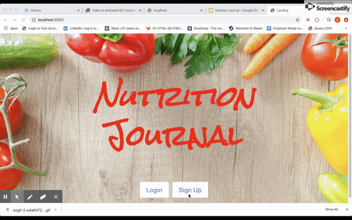
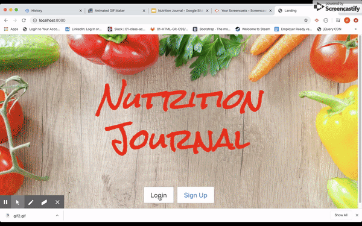

# Nutrition Journal

Description
---

Nutrition Log is an application where a user can sign up by creating an account and keep track of their nutrition habits.  This app allows you to enter the foods you have eaten and the nutritional facts about that food will be displayed. It also tells you how many calories are in that food.  The user can also enter exercise completed and the expected calories to burn will be provided. 

# Built With
 
Passport, Express, BULMA, Heroku, Sequelize, Javascript, jQuery, MySql
Handlebars, Nutritionix API

How To Use:
---

;

;

# Getting Started
Link to deployed app (https://salty-ravine-80275.herokuapp.com/)
---

# Credits

# License
MIT License

Copyright (c) [2020] [Thomas Argent, Sharon Yelverton, Matt Dominick, Alexander Garcia]

Permission is hereby granted, free of charge, to any person obtaining a copy of this software and associated documentation files (the "Software"), to deal in the Software without restriction, including without limitation the rights to use, copy, modify, merge, publish, distribute, sublicense, and/or sell copies of the Software, and to permit persons to whom the Software is furnished to do so, subject to the following conditions:

The above copyright notice and this permission notice shall be included in all copies or substantial portions of the Software.

THE SOFTWARE IS PROVIDED "AS IS", WITHOUT WARRANTY OF ANY KIND, EXPRESS OR IMPLIED, INCLUDING BUT NOT LIMITED TO THE WARRANTIES OF MERCHANTABILITY, FITNESS FOR A PARTICULAR PURPOSE AND NONINFRINGEMENT. IN NO EVENT SHALL THE AUTHORS OR COPYRIGHT HOLDERS BE LIABLE FOR ANY CLAIM, DAMAGES OR OTHER LIABILITY, WHETHER IN AN ACTION OF CONTRACT, TORT OR OTHERWISE, ARISING FROM, OUT OF OR IN CONNECTION WITH THE SOFTWARE OR THE USE OR OTHER DEALINGS IN THE SOFTWARE.